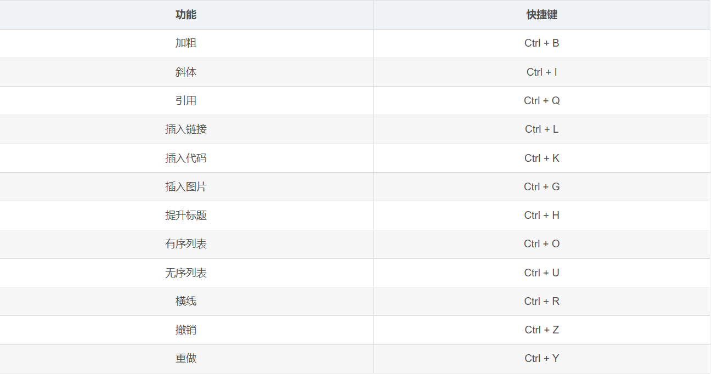
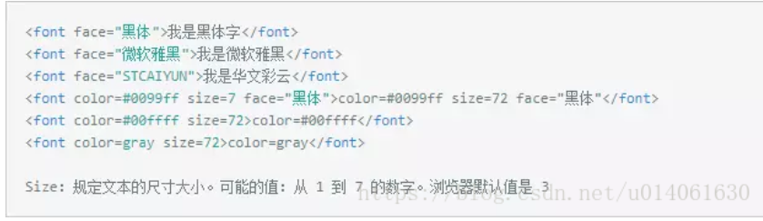

# 这是一级标题

## 这是二级标题

这是正文哦。  
上一行有两个空格可以换行。

这样就是换了一段。

**这是加粗，快捷键ctrl+B**

*这是斜体，快捷键ctrl+I*

1. 注意后面有一个空格
2. 1. 还可以分二级的哈哈哈
   2. 好厉害哦

直接复制粘贴就可以插入图片了


还有就是图片的格式是![]

$\sqrt{x^{2}}$快捷键是ctrl+M 


快捷键是ctrl+M两次
$$
\sqrt{x^{2}}
$$

### 这是三级标题

这是表格
小明|小红|小刚
---|---|---
1.5|1.6|1.7


这是一个[链接](https://www.bilibili.com/video/BV1si4y1472o/?spm_id_from=333.337.search-card.all.click&vd_source=f47e318890f59655b146fa1304b47067)


这是一个代码块

```cpp
#include <iostream>

using namespace std;

int main() {
    cout << "hello world!" << endl;
    return 0;
}
```


也可以插入行内代码`cout << "hello world！` 

这里有一些快捷键

这是一些字体与大小的设置
